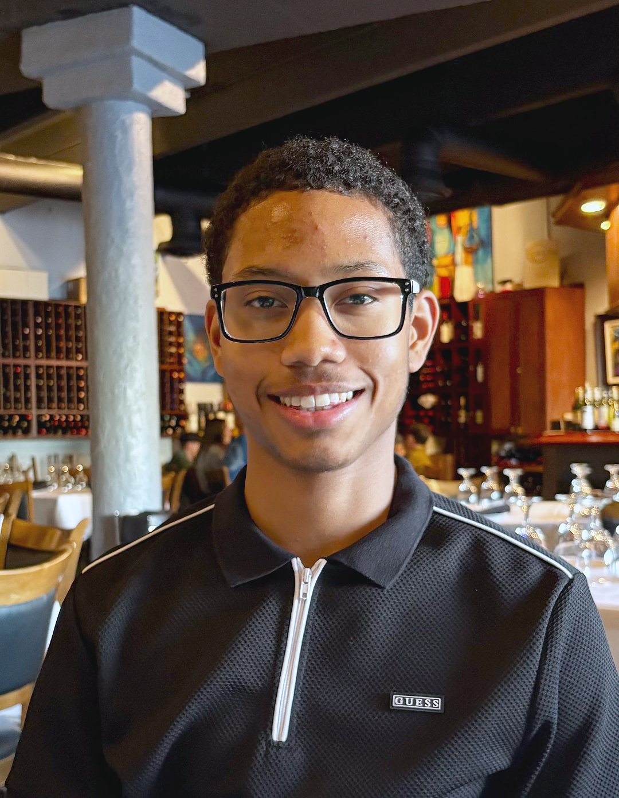

{: .profile-img}

Hello, I'm Abiel. I am an undergraduate computer engineer at [FIU](https://cec.fiu.edu/).

My primary focus lies in hardware-aware programming to accelerate machine learning inference. Often utilizing CUDA, C++, and PyTorch alongside profiling tools to guide my optimizations.

I am motivated by the human experience my optimizations bring to the end-user and the real-time feedback loop of collaborating on unsolved problems, especially in real-time systems for embodied AI.

### Background
<small>Previously interned at **NVIDIA** on the [ChipNemo](https://research.nvidia.com/publication/2023-10_chipnemo-domain-adapted-llms-chip-design) team. I also worked at FIU’s **Applied Research Center** under [Dr. Himanshu Upadhyay](https://arc.fiu.edu/staff/himanshu-upadhyay/). In both roles, I built LLM serving, retrieval, and deployment infrastructure and experimented with compiler front-ends for domain-specific languages.</small>

## Activity
- Currently: I'm working on a project for real-time 3D reconstruction. Providing [Splat-SLAM](https://github.com/google-research/Splat-SLAM) with a production-grade, low-latency infrastructure, from camera drivers to visualization.
- Nov 2025: Excited to share that I will be joining Apple AIML this summer as a Machine Learning Intern, possibly working on efficient on-device computer vision!
- Sept 2025: Check out [here](/projects/vision-rt) how I ditched OpenCV and cut e2e latency for image classification to a fraction of the original time!