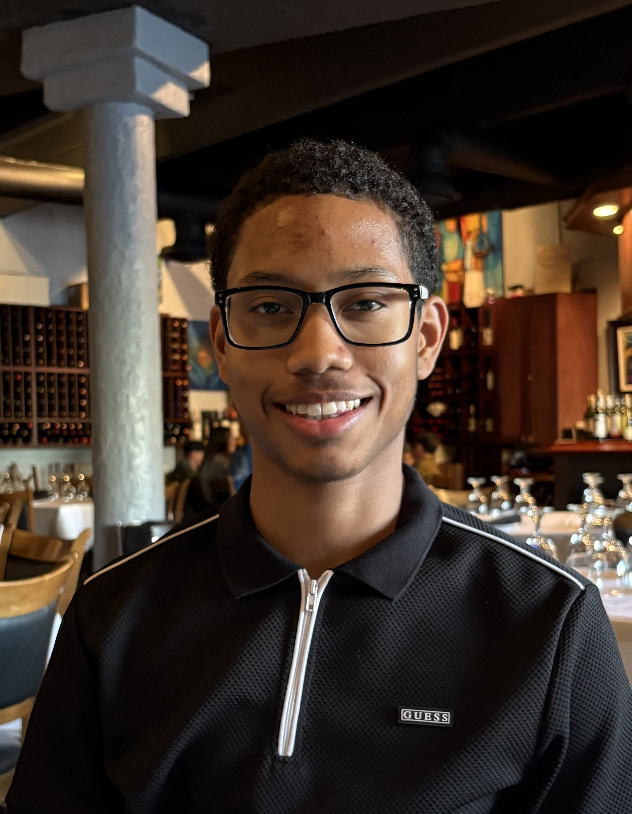

{: .profile-img}

Hello, I'm Abiel. I am an undergraduate computer engineer at Florida International University.

My primary focus lies in hardware-aware programming to accelerate machine learning inference. Often utilizing CUDA, C++, and PyTorch alongside profiling tools to guide my optimizations.

I am motivated by the human experience my optimizations bring to the end-user and the real-time feedback loop of collaborating on unsolved problems, especially in real-time systems for embodied AI.

## Activity
- Currently: I'm working on a project for real-time 3D reconstruction. Providing [Splat-SLAM](https://github.com/google-research/Splat-SLAM) with a production-grade, low-latency infrastructure, from camera drives to Gaussian rendering.
- Nov 2025: Excited to share that I will be joining Apple AIML this summer as a Machine Learning Intern, possibly working on efficient on-device computer vision!
- Sept 2025: Check out how I ditched OpenCV and cut e2e latency for image classification to a fraction of the original time!