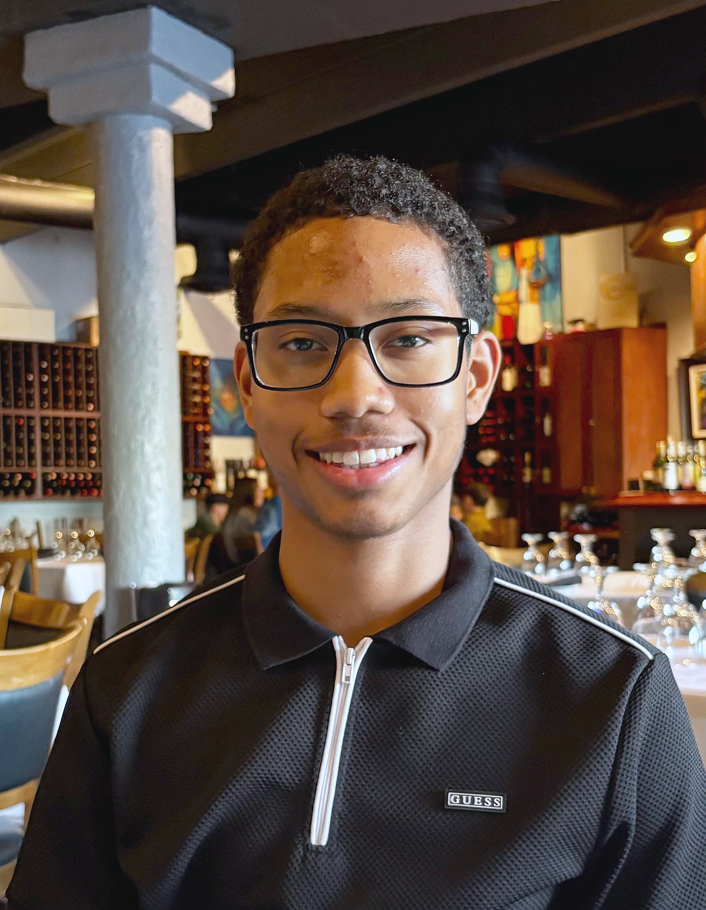

{: .profile-img .float-right}

Hello, I'm Abiel. I am an undergraduate computer engineer at [FIU](https://cec.fiu.edu/).

My primary focus lies in hardware-aware programming to accelerate machine learning inference. Often utilizing CUDA, C++, and PyTorch alongside profiling tools to guide my optimizations.

I am motivated by the human experience my optimizations bring to the end-user and the real-time feedback loop of collaborating on unsolved problems, especially in real-time systems for embodied AI.

<h3> Background </h3>

Previously interned at <strong>NVIDIA</strong> on the <a href="https://research.nvidia.com/publication/2023-10_chipnemo-domain-adapted-llms-chip-design">ChipNemo</a> team. I also worked at FIU's <strong>Applied Research Center</strong> under <a href="https://arc.fiu.edu/staff/himanshu-upadhyay/">Dr. Himanshu Upadhyay</a>. In both roles, I built LLM serving, retrieval, and deployment infrastructure and experimented with compiler front-ends for domain-specific languages.

---

<h3> Activity</h3>
- **Currently:** Working on flash-recon, real-time monocular SLAM with custom fused CUDA kernels, Gaussian Splatting, and DepthAnythingV2 on a single GPU. [link](/projects/flash-recon)
- **Feb 2026:** Built pperf, a hierarchical profiler for hunting bottlenecks in complex GPU systems. [link](/projects/pperf)
- **Feb 2026:** Published a technical deep dive showing how I reduced computer vision pipeline latency from 22ms to 11.3ms with microsecond consistency. [link](/projects/visionrt)
- **Nov 2025:** Excited to share that I will be joining Apple AIML this summer as a Machine Learning Intern, possibly working on efficient on-device computer vision!